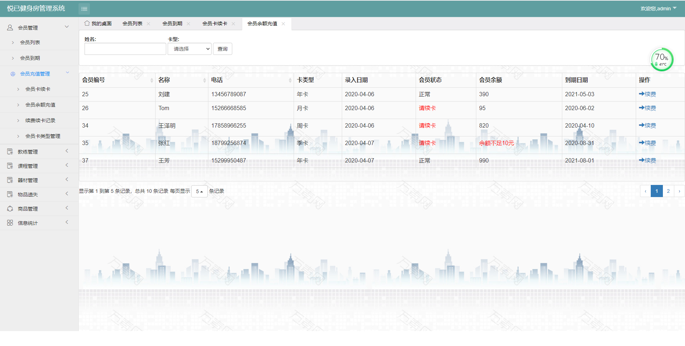

基于Springboot框架实现的健身房管理系统
=
###  完整代码获取地址：从戎源码网 ([https://armycodes.com/](https://armycodes.com/))
###  作者微信：19941326836  QQ：952045282 
###  承接计算机毕业设计、Java毕业设计、Python毕业设计、深度学习、机器学习
###  选题+开题报告+任务书+程序定制+安装调试+论文+答辩ppt 一条龙服务
###  毕业设计所有选题地址:(https://github.com/3212618475/allProject)

一、项目介绍
---
基于Spring Boot框架实现的健身房管理系统，系统包含两种角色：管理员、用户,系统分为前台和后台两大模块，主要功能如下。
具备功能：
管理员登录模块
会员管理模块
教练管理模块
课程管理模块
器材管理模块
物品遗失管理模块
商品管理模块
信息统计模块等等。

2.涉及技术框架：
---
web框架：SpringBoot
数据库框架：Sping Data JPA
数据库：MySql
项目构建工具：Maven
前端模板：JSP
安全框架：Shiro
前端框架：BootStrap,Layui
数据图表：ECharts

3.本项目所用环境：
---
开发工具：IDEA
编程语言：JDK1.8,HTML,CSS,JS，jQuery
数据库：mysql5.6
部署服务器：腾讯云Centos7

四、项目截图
---
文档截图

使用截图

